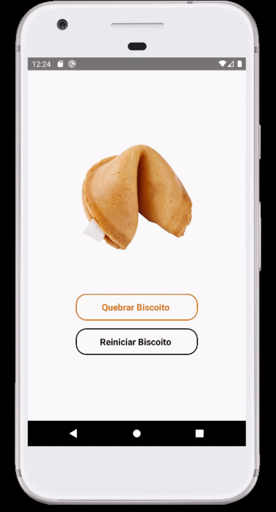

# Biscoito da Sorte

# Sobre o projeto

 Este projeto consiste em uma aplicação feita com React Native, cada vez que clicar no botão "Quebrar Biscoito", vai gerar uma frase na tela.


## Layout Mobile



# Tecnologias utilizadas 

- React Native
- HTML, CSS
- JavaScript

# Como rodar o projeto

Pré requisitos: Simulador aberto

```bash 
git clone https://github.com/leowingss/biscoito-da-sorte.git

# Entrar na pasta
cd biscoito-da-sorte

# Instalar dependências
npm install

# Executar o projeto
npx react-native run-android
``` 